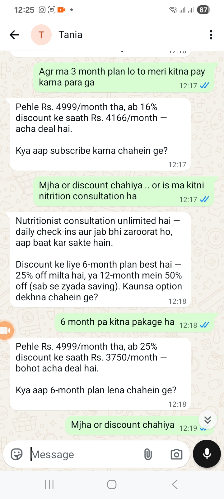

# 🤖 Tania — Autonomous WhatsApp AI Sales Agent

> **A fully autonomous AI sales agent deployed on WhatsApp that handles the entire sales journey — from first message to closed lead — without any human involvement.**

---

## 📊 Production Impact

| Metric | Result |
|---|---|
| Deployment | Live production system |
| Availability | 24/7 — zero downtime |
| Human involvement | Zero — fully autonomous |
| Languages | English + Roman Urdu |
| CRM Integration | Freshsales (auto lead generation) |
| Booking | Doctor & Nutritionist consultations |

---

## 🧠 What Tania Does

Tania is a production-grade AI sales agent deployed on WhatsApp that replaces an entire human sales team. She handles every step of the sales journey autonomously — from the first greeting to booking a consultation and generating a CRM lead.

### The Problem
A health and fitness company was selling structured health and nutrition plans but relied entirely on human sales agents over WhatsApp. This meant:
- Limited operating hours
- Inconsistent sales pitches
- Slow response times
- No scalability
- Most leads dropped off before speaking to an agent

### The Solution
Tania handles everything — no human required.

---

## ⚡ Full Feature Breakdown

### 🗣️ Intelligent Sales Conversation
- Opens natural conversation and collects user health data
- Computes BMI in real time (Python-calculated, injected into context to prevent hallucination)
- Recommends the right health plan based on BMI + stated health goal
- Delivers personalized pitch — not a generic script
- Responds in **English or Roman Urdu** based on how the user communicates

### 💰 Objection Handling & Upselling
- Handles pricing objections naturally
- Offers tiered discount structure (3-month, 6-month, 12-month plans)
- Upsells from lower to higher value plans based on conversation flow
- Fetches live plan details from backend API — always up to date

### 📅 Autonomous Booking System
- Books doctor and nutritionist consultations without human involvement
- Presents available time slots to the user
- Confirms appointment and adds to schedule automatically

### 🗂️ CRM Lead Generation
- Automatically creates a qualified lead in **Freshsales CRM**
- Captures: name, health data, BMI, goal, plan interest, booking status
- Zero manual data entry — every conversation becomes a tracked lead

### 📋 Personalized Transformation Plan
- Generates a unique transformation plan link for each user
- Shares a personalized health journey roadmap based on their specific profile
- Every user gets a different plan — no generic outputs

---

## 🛠️ Tech Stack

| Component | Technology |
|---|---|
| Agent Framework | LangGraph |
| LLM | GPT-4o |
| Conversation Channel | WhatsApp Business API |
| Backend | FastAPI |
| CRM Integration | Freshsales API |
| Plan Data | Custom Backend REST API |
| BMI Computation | Python (server-side) |
| Languages | English + Roman Urdu |
| Database | PostgreSQL |

---

## 🏗️ Architecture

```
User (WhatsApp)
      │
      ▼
WhatsApp Business API
      │
      ▼
FastAPI Backend
      │
      ▼
LangGraph State Machine
      │
      ├── Node 1: Data Collection
      │     └── Collects weight, height, gender, health goal
      │
      ├── Node 2: BMI Computation
      │     └── Python-calculated, injected as hardcoded fact
      │
      ├── Node 3: Plan Recommendation Engine
      │     └── Fetches live plan data from Backend API
      │     └── Routes to Basic / Standard / Premium
      │
      ├── Node 4: Personalized Pitch
      │     └── Generates custom pitch based on user profile
      │
      ├── Node 5: Objection Handler
      │     └── Discount logic, upsell flow
      │
      ├── Node 6: Booking System
      │     └── Slot selection + confirmation
      │
      ├── Node 7: CRM Lead Generation
      │     └── Freshsales API — auto lead creation
      │
      └── Node 8: Transformation Plan
            └── Generates personalized health journey link
```

---

## 🔑 Key Technical Decisions

**Why LangGraph?**
LangGraph allows true multi-stage conversation flow with dedicated nodes for each sales stage. Unlike simple prompt chaining, LangGraph maintains conversation state across the entire journey and allows conditional routing — for example, if a user says "too expensive," the agent routes to the objection handler node rather than continuing the sales pitch.

**Why Python-calculated BMI?**
Early versions let the LLM calculate BMI inside the prompt. This caused hallucinations — wrong values stated confidently. Moving calculation to Python server-side and injecting the result as a hardcoded fact eliminated this completely. In a health product, wrong numbers are unacceptable.

**Why WhatsApp?**
Zero friction for the user. No app download, no login, no new interface. Users already have WhatsApp — meeting them where they are dramatically increases engagement and reduces drop-off.

---

## 📸 Screenshots

### Complete Sales Journey

.png)

.png)



.png)

---

## 🔄 What Tania Replaced

| Human Role | Replaced By Tania |
|---|---|
| Sales Representative | ✅ Autonomous pitch + objection handling |
| Appointment Booking Staff | ✅ Autonomous slot selection + confirmation |
| CRM Data Entry Team | ✅ Auto lead creation in Freshsales |
| Health Plan Consultant | ✅ Personalized plan recommendation |

**Result:** 24/7 sales coverage, zero marginal cost per conversation, consistent pitch every single time — something no human sales team can match.

---

## 📁 Repository Structure

```
tania-whatsapp-ai-sales-agent/
├── Result/              # Demo screenshots
│   ├── image (2).png
│   ├── image (1).png
│   ├── image.png
│   └── image (3).png
├── README.md
```

---

## 📬 Want to Know More?

This is a production system handling real sales conversations and customer data. Deeper implementation details, architecture walkthrough, and live demo available upon request.

📧 adnanabdullah.dev@gmail.com
💼 [LinkedIn](https://linkedin.com/in/adnan-abdullah-70089937b) • [GitHub](https://github.com/adnanabdullah0405)
